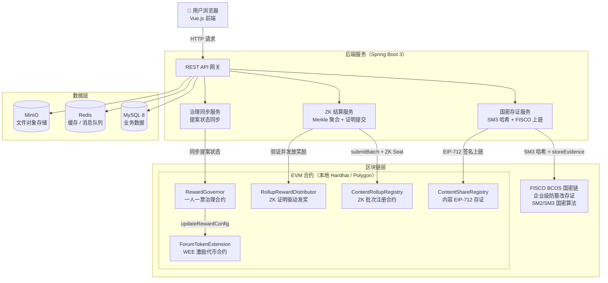
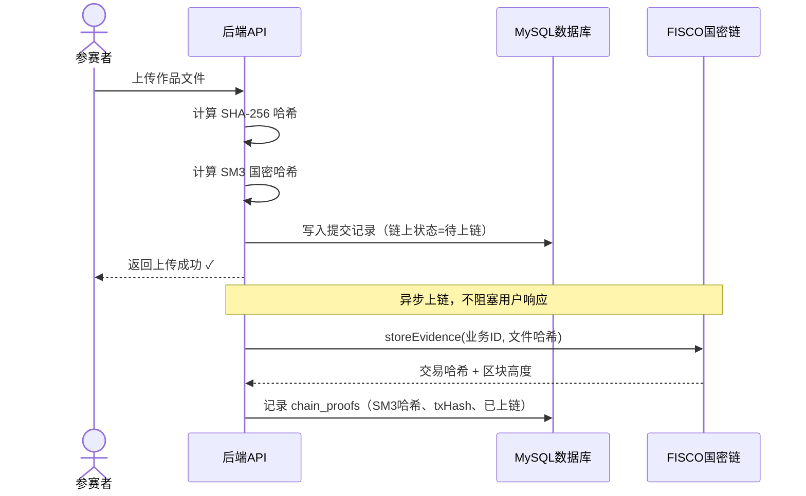
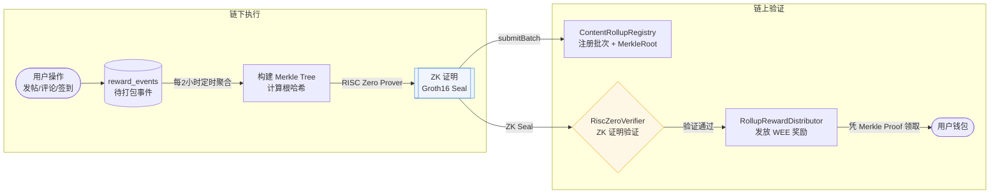
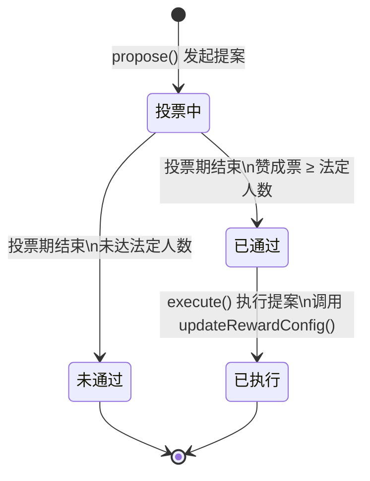

# 竞赛平台

> 基于 FISCO BCOS 国密存证 + RISC Zero ZK 可验证结算 + 链上参数治理的竞赛管理系统

本项目是一个完整的在线竞赛平台，用于解决竞赛场景中的**防篡改存证**、**可信奖励结算**和**参数安全变更**三个核心问题。

---

## 目录

- [架构总览](#架构总览)
- [核心模块一：国密存证链路](#核心模块一国密存证链路)
- [核心模块二：ZK-可验证结算](#核心模块二zk-可验证结算)
- [核心模块三：链上参数治理](#核心模块三链上参数治理)
- [一键本地复现](#一键本地复现)
- [项目结构](#项目结构)
- [技术栈](#技术栈)

---

## 架构总览



---

## 核心模块一：国密存证链路

### 解决的问题

竞赛平台需要对**作品提交**、**评测结果**、**榜单快照**提供不可篡改的存证，用于仲裁和审计。本模块同时计算 SHA-256 和国密 SM3 两种哈希，上链存证，满足国产自主可控要求。

### 链路设计



**关键设计：**
- **双哈希链**：SHA-256 校验文件完整性，SM3 随 FISCO 国密链上链，两条哈希互相印证
- **异步上链**：上传响应不等待区块确认，状态机（待上链 → 上链中 → 已上链/失败）跟踪进度
- **优雅降级**：FISCO 节点不可用时自动切换 Mock 实现，本地开发链路不中断

**存证查询接口：**
```
GET /api/chain/evidence/{bizType}/{bizId}
```

### 核心代码

| 文件 | 说明 |
|------|------|
| `SM3HashUtil.java` | 基于 BouncyCastle 的 SM3 国密哈希工具类 |
| `BlockchainService.java` | FISCO BCOS SDK 封装，国密链交互 |
| `BlockchainEvidenceService.java` | 异步上链处理，写入双哈希记录 |
| `ChainEvidenceController.java` | 存证查询 REST 接口 |
| `EvidenceContract.sol` | FISCO 链上存证合约 |

---

## 核心模块二：ZK 可验证结算

### 解决的问题

论坛激励（发帖/评论/签到）每次都触发链上交易会导致 Gas 费极高。但纯链下批量结算又无法证明"服务器没有作弊"。本模块用零知识证明解决这个矛盾：**链下批量执行，链上 ZK 证明验证**，Gas 节省 94%，同时结算过程链上可审计。

### 链路设计



**关键设计：**
1. **批次聚合**：将高频奖励事件打包为 Merkle Tree，单次链上操作覆盖整批用户
2. **ZK 证明**：链上合约只验证证明（O(1) 复杂度），不重复执行结算逻辑
3. **Merkle 领取**：用户提交自己的 Merkle Proof 即可自证领取资格，无需信任服务器
4. **本地 Mock**：没有 `rollup-prove` 二进制时，Mock 证明生成器自动启用，本地全链路可跑

### Gas 对比

| 方案 | 每次操作 Gas | 每天 50 次费用 | 30 MATIC 可用时长 |
|------|------------|--------------|-----------------|
| 逐笔上链 | ~50,000 | 2,500,000 gas | ~8 天 |
| **ZK Rollup（本项目）** | **~250,000 / 批次** | **~150,000 gas** | **~200 天** |

**节省 94% Gas，同时保持结算过程链上可验证。**

### 核心代码

| 文件 | 说明 |
|------|------|
| `RewardEventRollupService.java` | 定时聚合奖励事件，构建 Merkle Tree |
| `RewardProofGeneratorService.java` | 调用 rollup-prove 生成 ZK 证明（生产环境） |
| `MockRewardProofGeneratorService.java` | 本地开发用 Mock 证明生成器（自动激活） |
| `RollupChainService.java` | 向链上合约提交批次和证明 |
| `ContentRollupRegistry.sol` | 链上批次注册合约 |
| `RollupRewardDistributor.sol` | ZK 证明驱动的奖励发放合约 |
| `MockRiscZeroVerifier.sol` | 本地测试用 Mock 验证器 |
| `MerkleTreeUtil.java` | Merkle Tree 构建与证明生成 |

---

## 核心模块三：链上参数治理

### 解决的问题

激励参数（发帖奖励、签到奖励等数值）若直接由管理员在后台修改，存在单点风险且无迹可查。本模块通过链上治理合约实现**参数变更全程上链、可追溯、有延时安全边界**。

### 治理流程



**关键设计：**
- **一人一票**：不依赖代币权重，防止大户控制，Owner 管理投票人名单
- **calldata 驱动**：提案存储完整 ABI 编码的调用数据，执行时直接转发给目标合约
- **链上可追溯**：`ProposalCreated`、`VoteCast`、`ProposalExecuted` 事件永久记录变更历史
- **本地友好**：投票周期可在部署时配置（本地测试设为 60 秒）

### 示例：通过治理修改签到奖励

```javascript
// 1. 编码目标函数的 calldata
const newConfig = { dailyCheckinReward: ethers.parseEther("8"), /* 其余参数 */ }
const calldata = forumToken.interface.encodeFunctionData("updateRewardConfig", [newConfig])

// 2. 发起提案（任何已注册投票人均可发起）
await governor.propose("将每日签到奖励从 5 WEE 提升至 8 WEE", calldata)

// 3. 投票
await governor.vote(proposalId, true)  // true = 赞成

// 4. 投票期结束后执行（链上永久记录）
await governor.execute(proposalId)
```

### 核心代码

| 文件 | 说明 |
|------|------|
| `RewardGovernor.sol` | 一人一票治理合约（316 行完整实现） |
| `GovernorService.java` | 提案状态同步、链上查询服务 |
| `GovernorController.java` | 治理 REST 接口 |
| `GovernanceProposal.java` | 提案实体，链上状态同步到数据库 |

---

## 一键本地复现

### 环境要求

| 工具 | 版本 |
|------|------|
| Java | 17+ |
| Maven | 3.6+ |
| Node.js | 16+ |
| MySQL | 8.0 |
| Redis | 6.0+ |

### 启动步骤

```bash
# 1. 克隆项目
git clone https://github.com/zzzzzzzzzzhy/zk_fisco_platform.git
cd zk_fisco_platform

# 2. 复制环境变量模板并填写本地配置
cp .env.example .env

# 3. 一键启动
bash start-local.sh
```

启动脚本自动完成以下步骤：

```
✅ 检测 MySQL / Redis 连通性，初始化数据库表结构
✅ 启动 Hardhat 本地节点（端口 8545，chainId 31337）
✅ 编译并部署 5 个智能合约
   ├── MockWEEToken          本地测试代币（预充 50 万枚）
   ├── ForumTokenExtension   WEE 激励合约
   ├── ContentShareRegistry  内容存证合约
   ├── MockRiscZeroVerifier  ZK 证明 Mock 验证器
   └── RewardGovernor        参数治理合约
✅ 编译并启动后端（端口 8080）
✅ 启动前端开发服务器（端口 8084）
```

### 访问地址

| 服务 | 地址 |
|------|------|
| 前端页面 | http://localhost:8084 |
| 后端 API | http://localhost:8080/api |
| 存证查询接口 | http://localhost:8080/api/chain/evidence/{bizType}/{bizId} |
| Hardhat 节点 | http://127.0.0.1:8545 |
| MinIO 控制台 | http://localhost:9001（minioadmin / minioadmin） |

### 内置测试账号

| 账号 | 密码 | 权限 |
|------|------|------|
| admin | admin123 | 管理员（可创建竞赛、发布、管理） |

> 普通用户直接注册即可，默认角色为 USER。

### 验证存证链路

```bash
# 提交一份作品后，查询其链上存证记录
curl http://localhost:8080/api/chain/evidence/SUBMISSION/1
```

### 停止服务

```bash
bash stop-local.sh
```

---

## 项目结构

```
zk_fisco_platform/
├── backend/                          # Spring Boot 后端
│   └── src/main/java/.../
│       ├── service/
│       │   ├── BlockchainService.java            # FISCO BCOS 国密链调用
│       │   ├── BlockchainEvidenceService.java    # 异步双哈希上链
│       │   ├── WeeBalanceService.java            # WEE 积分余额管理
│       │   ├── RewardEventRollupService.java     # ZK Rollup 事件聚合
│       │   ├── RollupChainService.java           # Rollup 链上提交
│       │   ├── MockRewardProofGeneratorService   # 本地 Mock ZK 证明
│       │   └── GovernorService.java              # 治理提案同步
│       ├── controller/
│       │   ├── ChainEvidenceController.java      # 存证查询接口
│       │   ├── CheckinController.java            # 签到（+5 WEE）
│       │   └── WalletController.java             # WEE 余额查询
│       └── util/
│           └── SM3HashUtil.java                  # 国密 SM3 哈希工具
│
├── blockchain/                       # Hardhat 合约工程
│   ├── contracts/
│   │   ├── ForumTokenExtension.sol       # WEE 激励代币合约
│   │   ├── ContentShareRegistry.sol      # EIP-712 内容存证
│   │   ├── ContentRollupRegistry.sol     # ZK Rollup 批次注册
│   │   ├── RollupRewardDistributor.sol   # ZK 证明驱动发奖
│   │   ├── RewardGovernor.sol            # 一人一票治理合约
│   │   ├── MockWEEToken.sol              # 本地测试代币
│   │   ├── MockRiscZeroVerifier.sol      # 本地 Mock ZK 验证器
│   │   └── risc0/                        # RISC Zero 接口定义
│   ├── scripts/
│   │   └── deploy-local.js              # 本地一键部署脚本
│   └── deployments/
│       └── local.json                   # 本地合约地址记录
│
├── frontend/                         # Vue.js 2 前端
├── fisco/                            # FISCO BCOS 节点配置（生产环境）
├── docs/
│   └── zk-rollup-settlement-blog.md  # ZK Rollup 技术博客
├── start-local.sh                    # 一键启动脚本
├── stop-local.sh                     # 一键停止脚本
└── .env.example                      # 环境变量模板
```

---

## 技术栈

**后端**
- Spring Boot 3.5 + MyBatis-Plus + Spring Security + JWT
- FISCO BCOS Java SDK 2.9（国密链集成，SM2/SM3）
- web3j 4.x（EVM 链交互）
- BouncyCastle（SM3 国密哈希实现）

**智能合约**
- Solidity 0.8.24（EVM 目标: cancun）
- OpenZeppelin 5.x（ERC20、Ownable、ReentrancyGuard、EIP-712）
- RISC Zero Groth16 验证接口
- Hardhat（本地开发 + 合约部署）

**前端**
- Vue.js 2.6 + Vuex + Element UI

**数据层**
- MySQL 8.0 + Redis 7 + MinIO

**区块链**
- FISCO BCOS 2.9（国密，企业级存证）
- Hardhat 本地链 / Polygon 主网（EVM，ZK Rollup + 治理）
