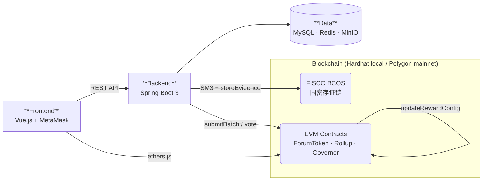
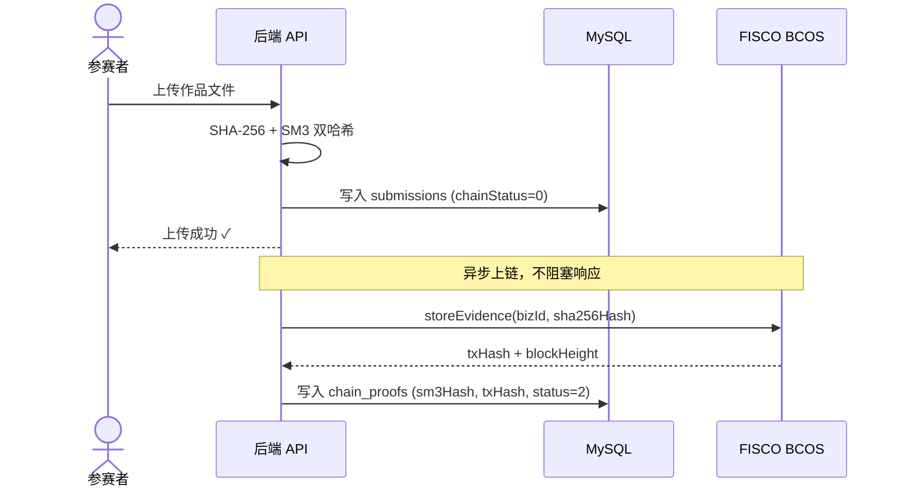
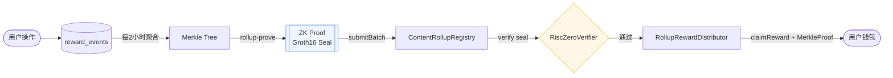
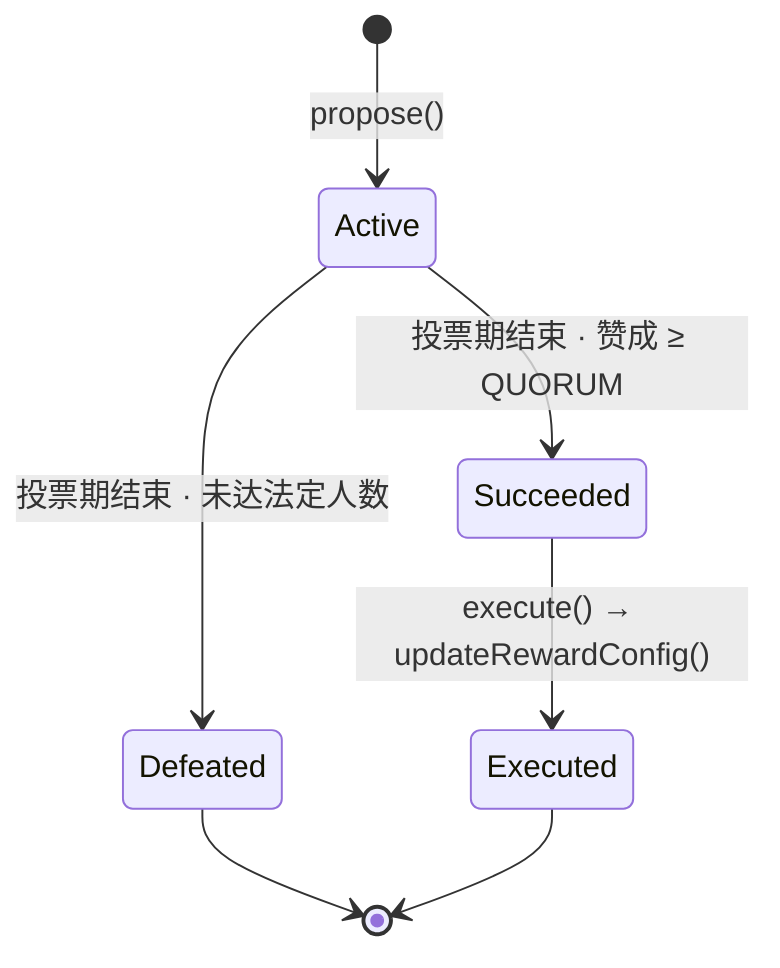

# 竞赛平台

> 基于 FISCO BCOS 国密存证 + RISC Zero ZK 可验证结算 + 链上参数治理的竞赛管理系统

本项目是一个完整的在线竞赛平台，用于解决竞赛场景中的**防篡改存证**、**可信奖励结算**和**参数安全变更**三个核心问题。

---

## 目录

- [架构总览](#架构总览)
- [核心模块一：国密存证链路](#核心模块一国密存证链路)
- [核心模块二：ZK 可验证结算](#核心模块二zk-可验证结算)
- [核心模块三：链上参数治理](#核心模块三链上参数治理)
- [一键本地复现](#一键本地复现)
- [项目结构](#项目结构)
- [技术栈](#技术栈)

---

## 架构总览



---

## 核心模块一：国密存证链路

### 解决的问题

竞赛平台需要对**作品提交**、**评测结果**、**榜单快照**提供不可篡改的存证，用于仲裁和审计。单一哈希算法存在算法风险，因此本模块同时计算 SHA-256 和国密 SM3 两种哈希，分别上链。

### 链路设计



**关键设计：**
- 双哈希链（SHA-256 + SM3）：SHA-256 用于文件完整性校验，SM3 随 FISCO 国密链上链，满足国产自主可控要求
- 异步上链：上传响应不等待区块确认，通过状态机（0→1→2/3）跟踪上链进度
- 降级策略：FISCO 节点不可用时自动 fallback 到 Mock 实现，本地开发不中断

**验证接口：**
```
GET /api/chain/evidence/{bizType}/{bizId}
```

返回完整的链上存证记录，包含 txHash、blockHeight、SM3 哈希，用于仲裁验证。

### 核心代码

| 文件 | 说明 |
|------|------|
| `SM3HashUtil.java` | 基于 BouncyCastle 的 SM3 国密哈希工具类 |
| `BlockchainService.java` | FISCO BCOS SDK 调用封装，国密链交互 |
| `BlockchainEvidenceService.java` | 异步上链处理，双哈希记录 |
| `ChainEvidenceController.java` | 存证查询 REST 接口 |
| `EvidenceContract.sol` | FISCO BCOS 链上存证合约（国密 Solidity） |

---

## 核心模块二：ZK 可验证结算

### 解决的问题

论坛激励（发帖/评论/签到奖励）每次发放都触发链上交易，Gas 费极高。同时，纯链下批量结算无法证明"服务器没有作弊"。本模块用 ZK 证明替代对中心化结算方的信任：**结算逻辑在链下执行，但通过 RISC Zero 零知识证明在链上验证**，既节省 Gas（约 96%），又保证可审计。

### 链路设计



**关键设计：**

1. **批次聚合**：每 2 小时将所有 `reward_events` 打包，构建 Merkle Tree，节省链上存储
2. **ZK 证明**：RISC Zero 的 `rollup-prove` 程序对批次数据生成 Groth16 证明。链上 `RiscZeroVerifier` 只需验证证明，无需重新执行结算逻辑
3. **Merkle 领取**：用户提交 Merkle Proof 从 `RollupRewardDistributor` 领取奖励，合约验证后发放 WEE 代币
4. **本地 Mock**：无 `rollup-prove` 二进制时，`MockRewardProofGeneratorService` 自动生成占位证明，配合 `MockRiscZeroVerifier` 实现本地全链路测试

### Gas 对比

| 方案 | 每次操作 Gas | 每天 50 次 Gas 费 | 30 MATIC 能撑多久 |
|------|-------------|-------------------|------------------|
| 逐笔上链 | ~50,000 | 2,500,000 | ~8 天 |
| **ZK Rollup（本项目）** | **~250,000 / 批** | **~150,000** | **~200 天** |

**节省 94% Gas，同时保持链上可验证性。**

### 核心代码

| 文件 | 说明 |
|------|------|
| `RewardEventRollupService.java` | 定时聚合 reward_events，构建 Merkle Tree |
| `RewardProofGeneratorService.java` | 调用 rollup-prove 生成 ZK 证明（生产） |
| `MockRewardProofGeneratorService.java` | 本地开发 Mock 证明生成器 |
| `RollupChainService.java` | web3j 封装，向链上合约提交批次 |
| `ContentRollupRegistry.sol` | 链上批次注册合约 |
| `RollupRewardDistributor.sol` | ZK 证明驱动的奖励发放合约 |
| `MockRiscZeroVerifier.sol` | 本地测试用 Mock 验证器（永远通过） |
| `MerkleTreeUtil.java` | Merkle Tree 构建与证明生成 |

---

## 核心模块三：链上参数治理

### 解决的问题

论坛激励参数（发帖奖励、签到奖励等）如果直接由管理员修改，存在单点风险。本模块通过链上治理合约实现**参数变更可追溯、有延时安全边界**——任何奖励配置修改都需要经过提案 → 投票 → 时延 → 执行的完整链上流程。

### 治理流程



**关键设计：**
- **一人一票**：不依赖代币权重（防止大户控制），Owner 管理投票人名单
- **法定人数（QUORUM=1）**：本地测试单人即可完成完整流程验证
- **calldata 驱动**：提案存储完整的 ABI 编码 calldata，执行时直接 `call` 目标合约，无需特殊接口
- **链上可追溯**：`ProposalCreated`、`VoteCast`、`ProposalExecuted` 事件记录完整变更历史

### 示例：修改签到奖励

```javascript
// 1. 编码 calldata
const newConfig = {
  postReward: ethers.parseEther("10"),
  commentReward: ethers.parseEther("2"),
  dailyCheckinReward: ethers.parseEther("8"),  // 从 5 → 8
  featuredPostReward: ethers.parseEther("50"),
  consecutiveBonus: ethers.parseEther("30"),
  contentImageReward: ethers.parseEther("5"),
  contentVideoReward: ethers.parseEther("10"),
}
const calldata = forumToken.interface.encodeFunctionData("updateRewardConfig", [newConfig])

// 2. 提案
const tx = await governor.propose("将签到奖励从 5 WEE 提升至 8 WEE", calldata)

// 3. 投票（VOTING_PERIOD=60s，本地测试友好）
await governor.vote(proposalId, true)

// 4. 执行（投票期结束后）
await governor.execute(proposalId)
// ForumTokenExtension 的奖励配置已链上更新，事件日志永久记录
```

### 核心代码

| 文件 | 说明 |
|------|------|
| `RewardGovernor.sol` | 一人一票治理合约，316 行完整实现 |
| `GovernorService.java` | 治理提案同步、状态查询服务 |
| `GovernorController.java` | 治理 REST 接口 |
| `GovernanceProposal.java` | 提案实体（链上状态同步到数据库） |

---

## 一键本地复现

> **任何人 clone 后，不花钱、不依赖外部服务，本地跑通完整链路。**

### 环境要求

| 工具 | 版本 |
|------|------|
| Java | 17+ |
| Maven | 3.6+ |
| Node.js | 16+ |
| MySQL | 8.0 |
| Redis | 6.0+ |

### 启动步骤

```bash
# 1. Clone 项目
git clone <your-repo-url>
cd competition-platform

# 2. 复制环境变量模板
cp .env.example .env
# 编辑 .env，填入本地 MySQL/Redis 密码

# 3. 一键启动（自动完成：数据库初始化 → Hardhat 节点 → 合约部署 → 后端 → 前端）
bash start-local.sh
```

启动脚本会依次完成：

```
✅ MySQL 数据库检测 + 表初始化
✅ Redis 连通性检测
✅ Hardhat 本地节点启动（端口 8545，chainId 31337）
✅ 合约编译 + 部署（5 个合约）
   - MockWEEToken
   - ForumTokenExtension（500,000 WEE 奖励池）
   - ContentShareRegistry
   - MockRiscZeroVerifier
   - RewardGovernor（治理权限已绑定）
✅ 后端编译 + 启动（端口 8080）
✅ 前端启动（端口 8084）
```

### 访问地址

| 服务 | 地址 |
|------|------|
| 前端页面 | http://localhost:8084 |
| 后端 API | http://localhost:8080/api |
| 链上存证查询 | http://localhost:8080/api/chain/evidence/{bizType}/{bizId} |
| Hardhat 节点 | http://127.0.0.1:8545 |

### MetaMask 本地网络配置

```
网络名称: Hardhat Local
RPC URL:  http://127.0.0.1:8545
链 ID:    31337
货币符号: ETH
```

导入测试账户：`npx hardhat node` 启动后终端会打印 10 个测试账户及其私钥，用第一个（Account #0）即可。

### 验证链路

```bash
# 查询某次提交的链上存证
curl http://localhost:8080/api/chain/evidence/SUBMISSION/1

# 返回示例
{
  "code": 200,
  "data": [{
    "bizType": "SUBMISSION",
    "bizId": 1,
    "txHash": "0xabc...",
    "blockHeight": 5,
    "chainNetwork": "FISCO",
    "metadata": "{\"sm3Hash\":\"...\",\"fileHash\":\"...\"}",
    "status": 2
  }]
}
```

### 停止服务

```bash
bash stop-local.sh
```

---

## 项目结构

```
competition-platform/
├── backend/                         # Spring Boot 后端
│   └── src/main/java/.../
│       ├── service/
│       │   ├── BlockchainService.java           # FISCO BCOS 国密链调用
│       │   ├── BlockchainEvidenceService.java   # 异步存证（双哈希）
│       │   ├── RewardEventRollupService.java    # ZK Rollup 聚合
│       │   ├── RollupChainService.java          # Rollup 链上提交
│       │   ├── MockRewardProofGeneratorService  # 本地 Mock ZK 证明
│       │   ├── GovernorService.java             # 治理同步
│       │   └── ForumTokenRewardService.java     # WEE 代币奖励
│       ├── controller/
│       │   └── ChainEvidenceController.java     # 存证查询接口
│       └── util/
│           └── SM3HashUtil.java                 # 国密 SM3 哈希工具
│
├── blockchain/                      # Hardhat 合约工程
│   ├── contracts/
│   │   ├── ForumTokenExtension.sol      # WEE 代币 + 激励规则
│   │   ├── ContentShareRegistry.sol     # EIP-712 内容存证
│   │   ├── ContentRollupRegistry.sol    # ZK Rollup 批次注册
│   │   ├── RollupRewardDistributor.sol  # ZK 证明驱动发奖
│   │   ├── RewardGovernor.sol           # 一人一票治理合约
│   │   ├── MockWEEToken.sol             # 本地测试代币
│   │   ├── MockRiscZeroVerifier.sol     # 本地 Mock ZK 验证器
│   │   └── risc0/                       # RISC Zero 接口定义
│   ├── scripts/
│   │   └── deploy-local.js             # 本地一键部署脚本
│   └── deployments/
│       └── local.json                  # 本地部署地址记录
│
├── frontend/                        # Vue.js 前端
├── fisco/                           # FISCO BCOS 节点配置（生产）
├── start-local.sh                   # 一键启动脚本
├── stop-local.sh                    # 一键停止脚本
└── .env.example                     # 环境变量模板
```

---

## 技术栈

**后端**
- Spring Boot 3.5 + MyBatis-Plus + Spring Security + JWT
- FISCO BCOS Java SDK 2.9（国密链集成）
- web3j 4.x（EVM 链交互）
- BouncyCastle（SM3 国密哈希）

**智能合约**
- Solidity 0.8.24（EVM 目标: cancun）
- OpenZeppelin 5.x（ERC20、Ownable、ReentrancyGuard、EIP-712）
- RISC Zero Groth16 验证接口
- Hardhat（本地开发 + 测试）

**前端**
- Vue.js 2.6 + Vuex + Element UI
- ethers.js 5（Web3 交互）
- MetaMask 集成

**数据层**
- MySQL 8.0 + Redis 7 + MinIO

**区块链**
- FISCO BCOS 2.9（国密，SM2/SM3，企业级存证）
- Polygon Mainnet / Hardhat Local（EVM，ZK Rollup + 治理）
