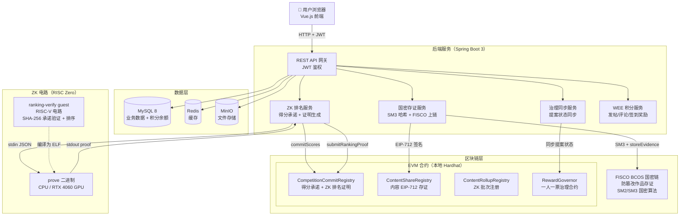
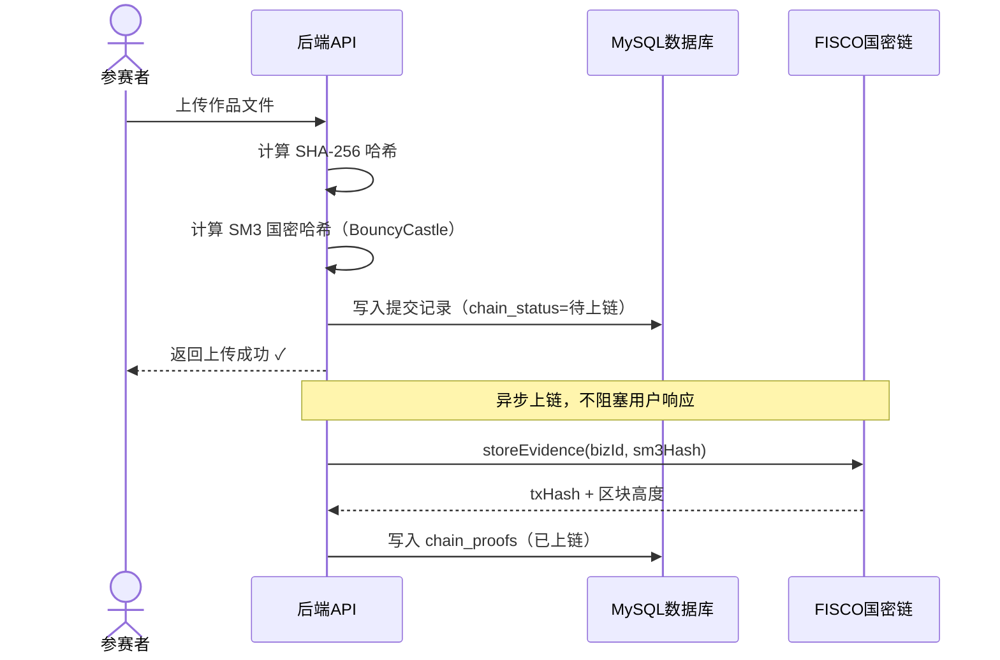
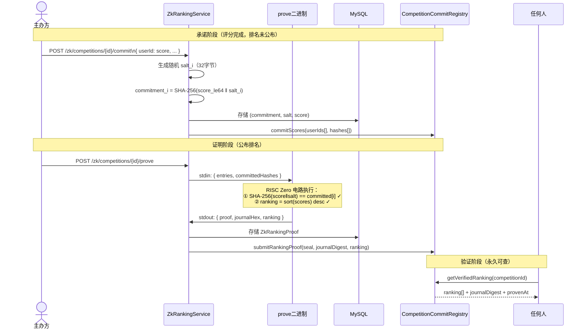
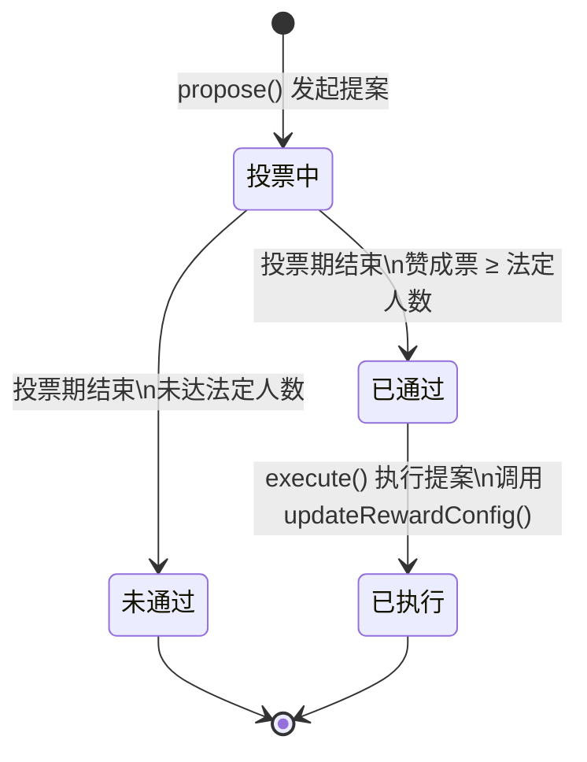

# 竞赛平台

> 基于 FISCO BCOS 国密存证 + RISC Zero ZK 可验证排名 + 链上参数治理的竞赛管理系统

本项目是一个完整的在线竞赛平台，用于解决竞赛场景中的**防篡改存证**、**可信排名证明**和**参数安全变更**三个核心问题。

任何人 clone 之后，只需一条命令即可在本地跑通含智能合约的完整链路，无需任何付费 RPC 或云服务。

---

## 目录

- [架构总览](#架构总览)
- [核心模块一：国密存证链路](#核心模块一国密存证链路)
- [核心模块二：ZK 可验证排名](#核心模块二zk-可验证排名)
- [核心模块三：链上参数治理](#核心模块三链上参数治理)
- [一键本地复现](#一键本地复现)
- [项目结构](#项目结构)
- [技术栈](#技术栈)

---

## 架构总览



---

## 核心模块一：国密存证链路

### 解决的问题

竞赛平台需要对**作品提交**、**评测结果**、**榜单快照**提供不可篡改的存证，用于仲裁和审计。本模块同时计算 SHA-256 和国密 SM3 两种哈希，上链存证，满足国产自主可控要求。

### 链路设计



**关键设计：**
- **双哈希链**：SHA-256 校验文件完整性，SM3 随 FISCO 国密链上链，两条哈希互相印证
- **异步上链**：上传响应不等待区块确认，状态机追踪进度（待上链 → 上链中 → 已上链）
- **优雅降级**：FISCO 节点不可用时自动切换 Mock 实现，本地开发链路不中断

**存证查询：**
```bash
GET /api/chain/evidence/{bizType}/{bizId}
```

### 核心代码

| 文件 | 说明 |
|------|------|
| `SM3HashUtil.java` | 基于 BouncyCastle 的 SM3 国密哈希工具类 |
| `BlockchainService.java` | FISCO BCOS SDK 封装，国密链交互 |
| `BlockchainEvidenceService.java` | 异步双哈希上链处理 |
| `ChainEvidenceController.java` | 存证查询 REST 接口 |

---

## 核心模块二：ZK 可验证排名

### 解决的问题

在线竞赛有一个天然的作弊风险：**主办方可以在看到其他队排名之后，悄悄修改某队的得分**，而参赛者无法察觉。

本模块通过"得分承诺 + ZK 证明"彻底解决这个问题：
1. **承诺阶段**：公布排名前，主办方对每位参赛者的得分计算承诺哈希 `SHA-256(score || salt)` 并上链
2. **证明阶段**：RISC Zero zkVM 电路验证承诺合法且排名由得分正确排序，产出 ZK 证明
3. **验证阶段**：任何人可以用参赛者自己的 `(score, salt)` 对照承诺哈希，链上 ZK 证明永久可查

### 链路设计



### ZK 电路（RISC Zero guest）

```
zk/methods/guest/src/main.rs
```

电路约束两件事：

```
私有输入：entries[i] = { user_id, score, salt[32] }
公开输入：competition_id, committed_hashes[i]

约束①  ∀i: SHA-256(score_i LE64 ‖ salt_i) == committed_hashes[i]
约束②  ranking = argsort(scores, desc)，相同分数按 user_id 升序
```

journal（公开输出）永久锁定：`competition_id + committed_hashes[] + ranking[]`

### GPU 加速

本项目使用 RISC Zero 3.0.5 + CUDA 后端，RTX 4060 实测：

| 模式 | 电路规模（3人） | 证明时间 |
|------|--------------|---------|
| CPU（debug） | ~150K cycles | ~60 秒 |
| **RTX 4060 GPU** | ~150K cycles | **~2 秒** |

**启用 GPU 证明：**
```bash
# 编译（需要 CUDA 12.6 + libclang）
export CUDA_HOME=/usr/local/cuda-12.6
export LIBCLANG_PATH=/usr/lib/x86_64-linux-gnu
cd zk && cargo build -p zk-host

# 配置后端使用 GPU prover
export ZK_RANKING_PROVER_BINARY=/path/to/zk/target/debug/prove
export LD_LIBRARY_PATH=/usr/local/cuda-12.6/lib64:$LD_LIBRARY_PATH
```

不配置则自动使用 Java 内置 Mock Prover（本地开发，无需 Rust）。

### API 接口

| 方法 | 路径 | 权限 | 说明 |
|------|------|------|------|
| POST | `/zk/competitions/{id}/commit` | 管理员 | 提交得分承诺 |
| POST | `/zk/competitions/{id}/prove` | 管理员 | 生成 ZK 排名证明 |
| GET  | `/zk/competitions/{id}/proof` | 公开 | 查看 ZK 证明和排名 |
| GET  | `/zk/competitions/{id}/commitments` | 公开 | 查看所有承诺哈希 |
| GET  | `/zk/competitions/{id}/commitments/me` | 登录 | 查看自己的承诺（含盐，自验证用） |

### 核心代码

| 文件 | 说明 |
|------|------|
| `zk/methods/guest/src/main.rs` | RISC Zero 电路（约束 SHA-256 承诺 + 排名排序） |
| `zk/host/src/prove.rs` | Host prover：stdin JSON → 真实 ZK 证明 → stdout JSON |
| `zk/host/src/verify.rs` | 独立验证器，检测 journal 篡改 |
| `CompetitionCommitRegistry.sol` | 链上承诺存储 + ZK 证明验证 |
| `ZkRankingService.java` | 核心服务：Mock/GPU prover 桥接 |
| `ZkRankingController.java` | REST 接口 |

---

## 核心模块三：链上参数治理

### 解决的问题

激励参数（发帖奖励、签到奖励等数值）若直接由管理员在后台修改，存在单点风险且无迹可查。本模块通过链上治理合约实现**参数变更全程上链、可追溯、有延时安全边界**。

### 治理流程



**关键设计：**
- **一人一票**：不依赖代币权重，防止大户控制，Owner 管理投票人名单
- **calldata 驱动**：提案存储完整 ABI 编码的调用数据，执行时直接转发给目标合约
- **链上可追溯**：`ProposalCreated`、`VoteCast`、`ProposalExecuted` 事件永久记录变更历史
- **本地友好**：投票周期在部署时配置（本地测试 60 秒，生产默认 2 天）

### 示例：通过治理修改签到奖励

```javascript
// 1. 编码目标函数的 calldata
const calldata = forumToken.interface.encodeFunctionData("updateRewardConfig", [newConfig])

// 2. 发起提案
await governor.propose("将每日签到奖励从 5 WEE 提升至 8 WEE", calldata)

// 3. 投票
await governor.vote(proposalId, true)  // true = 赞成

// 4. 投票期结束后执行（链上永久记录）
await governor.execute(proposalId)
```

### 核心代码

| 文件 | 说明 |
|------|------|
| `RewardGovernor.sol` | 一人一票治理合约（完整实现） |
| `GovernorService.java` | 提案状态同步、链上查询 |
| `GovernorController.java` | 治理 REST 接口 |

---

## 一键本地复现

### 环境要求

| 工具 | 版本 | 说明 |
|------|------|------|
| Java | 17+ | 后端运行时 |
| Maven | 3.6+ | 后端构建 |
| Node.js | 16+ | 前端 + Hardhat |
| MySQL | 8.0 | 业务数据库（端口 3307） |
| Redis | 6.0+ | 缓存（无密码） |
| MinIO | 可选 | 文件存储（不启动则文件上传不可用） |

> ZK 真实证明可选：需要 Rust + rzup + CUDA（RTX 4060 约 2 秒）；不配置则自动使用 Java Mock Prover。

### 启动步骤

```bash
# 1. 克隆项目
git clone https://github.com/zzzzzzzzzzhy/zk_fisco_platform.git
cd zk_fisco_platform

# 2. 配置环境变量（主要是数据库密码）
cp .env.example .env

# 3. 一键启动
bash start-local.sh
```

启动脚本自动完成以下步骤：

```
✅ 检测 MySQL / Redis 连通性，初始化数据库表结构
✅ 启动 Hardhat 本地节点（端口 8545，chainId 31337）
✅ 编译并部署 6 个智能合约
   ├── MockWEEToken                本地测试代币（预充 50 万枚）
   ├── ForumTokenExtension         WEE 激励合约
   ├── ContentShareRegistry        内容存证合约
   ├── MockRiscZeroVerifier        ZK 证明 Mock 验证器（本地用）
   ├── RewardGovernor              参数治理合约
   └── CompetitionCommitRegistry   得分承诺 + ZK 排名验证合约
✅ 编译并启动后端（端口 8080）
✅ 启动前端开发服务器（端口 8084）
```

### 访问地址

| 服务 | 地址 |
|------|------|
| 前端页面 | http://localhost:8084 |
| 后端 API | http://localhost:8080/api |
| 存证查询 | http://localhost:8080/api/chain/evidence/{bizType}/{bizId} |
| ZK 排名证明 | http://localhost:8080/api/zk/competitions/{id}/proof |
| Hardhat 节点 | http://127.0.0.1:8545 |
| MinIO 控制台 | http://localhost:9001（minioadmin / minioadmin） |

### 内置测试账号

| 账号 | 密码 | 权限 |
|------|------|------|
| admin | admin123 | 管理员（创建竞赛、提交承诺、触发 ZK 证明） |

普通用户直接注册即可，默认角色为 USER。

### 快速验证各模块

```bash
BASE=http://localhost:8080/api

# 1. 登录获取 token
TOKEN=$(curl -s -X POST $BASE/auth/login \
  -H "Content-Type: application/json" \
  -d '{"username":"admin","password":"admin123"}' | python3 -c "import sys,json; print(json.load(sys.stdin)['data']['token'])")

# 2. 创建竞赛
COMP=$(curl -s -X POST $BASE/competitions \
  -H "Authorization: Bearer $TOKEN" \
  -H "Content-Type: application/json" \
  -d '{"title":"测试竞赛","status":1}' | python3 -c "import sys,json; print(json.load(sys.stdin)['data']['id'])")

# 3. 提交得分承诺（承诺阶段）
curl -s -X POST $BASE/zk/competitions/$COMP/commit \
  -H "Authorization: Bearer $TOKEN" \
  -H "Content-Type: application/json" \
  -d '{"2":9200,"3":8800,"4":7500}' | python3 -m json.tool

# 4. 生成 ZK 排名证明（Mock，无需 Rust）
curl -s -X POST $BASE/zk/competitions/$COMP/prove \
  -H "Authorization: Bearer $TOKEN" | python3 -m json.tool

# 5. 任何人可验证排名（公开接口）
curl -s $BASE/zk/competitions/$COMP/proof | python3 -m json.tool

# 6. 国密存证查询
curl -s $BASE/chain/evidence/REGISTRATION/1 | python3 -m json.tool
```

---

## 项目结构

```
zk_fisco_platform/
├── backend/                              # Spring Boot 后端
│   └── src/main/java/.../
│       ├── service/
│       │   ├── ZkRankingService.java         # ZK 排名核心服务（承诺/证明/验证）
│       │   ├── BlockchainEvidenceService.java # 国密异步双哈希上链
│       │   ├── WeeBalanceService.java         # WEE 积分管理
│       │   └── GovernorService.java           # 治理提案同步
│       ├── controller/
│       │   ├── ZkRankingController.java      # ZK 排名 REST 接口
│       │   ├── ChainEvidenceController.java  # 存证查询接口
│       │   ├── CheckinController.java        # 签到（+5 WEE）
│       │   └── WalletController.java         # WEE 余额查询
│       └── util/
│           └── SM3HashUtil.java              # 国密 SM3 哈希
│
├── zk/                                   # RISC Zero ZK 电路（Rust）
│   ├── methods/guest/src/main.rs             # ZK 电路核心：SHA-256 承诺验证 + 排名排序
│   ├── host/src/prove.rs                     # Host prover：JSON → ZK 证明
│   └── host/src/verify.rs                    # 独立验证器
│
├── blockchain/                           # Hardhat 合约工程
│   ├── contracts/
│   │   ├── CompetitionCommitRegistry.sol  # 得分承诺 + ZK 排名验证合约 ⭐
│   │   ├── RewardGovernor.sol             # 一人一票治理合约
│   │   ├── ContentShareRegistry.sol       # EIP-712 内容存证
│   │   ├── ContentRollupRegistry.sol      # ZK 批次注册
│   │   ├── MockRiscZeroVerifier.sol       # 本地 Mock ZK 验证器
│   │   └── MockWEEToken.sol              # 本地测试代币
│   └── scripts/
│       └── deploy-local.js               # 一键部署 6 个合约
│
├── frontend/                             # Vue.js 2 前端
├── fisco/                                # FISCO BCOS 节点配置
├── docs/
│   └── zk-rollup-settlement-blog.md     # ZK 技术博客
├── start-local.sh                        # 一键启动
└── stop-local.sh                         # 一键停止
```

---

## 技术栈

**后端**
- Spring Boot 3.5 + MyBatis-Plus + Spring Security + JWT
- FISCO BCOS Java SDK 2.9（国密链集成，SM2/SM3）
- web3j 4.x（EVM 链交互）
- BouncyCastle（SM3 国密哈希实现）

**ZK 电路**
- RISC Zero zkVM 3.0.5（RISC-V zkVM）
- Groth16 证明系统
- CUDA 后端（RTX 4060 GPU 加速，~2 秒出证明）
- 内置 Mock Prover（本地开发，无需 Rust/GPU）

**智能合约**
- Solidity 0.8.24（evmVersion: cancun）
- OpenZeppelin 5.x（ERC20、Ownable、EIP-712）
- RISC Zero `IRiscZeroVerifier` 接口
- Hardhat（本地开发 + 合约部署，chainId 31337）

**前端**
- Vue.js 2.6 + Vuex + Element UI

**数据层**
- MySQL 8.0 + Redis 7 + MinIO

**区块链**
- FISCO BCOS 2.9（国密，企业级存证）
- Hardhat 本地链（EVM，ZK 排名 + 治理）
