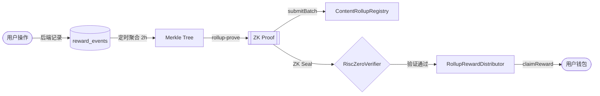
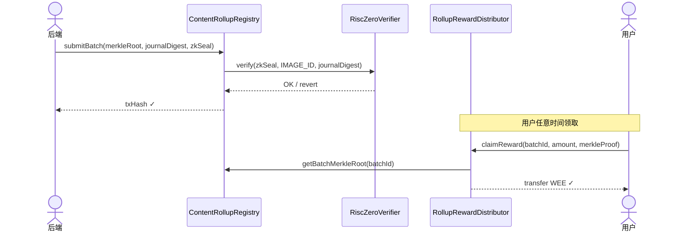

# 用 RISC Zero 实现链下批量结算的链上可验证

> 本文介绍了竞赛平台 WEE 激励系统的 ZK Rollup 结算方案：如何在节省 94% Gas 的同时，用零知识证明保证链下结算过程可审计、不可作弊。

---

## 背景：为什么需要 ZK 结算？

竞赛平台的论坛有三类激励行为：**发帖**（+10 WEE）、**评论**（+2 WEE）、**每日签到**（+5 WEE）。

最直接的实现是每次行为触发一笔链上转账——但这立刻暴露了两个问题：

**问题一：Gas 费不可持续**

以 Polygon 主网为例，每笔 ERC-20 转账约 50,000 gas。假设平台每天有 50 次激励行为：

```
50 × 50,000 gas × 50 Gwei = 125,000,000 Gwei = 0.125 MATIC/天
30 MATIC ≈ 240 天
```

看起来还好，但活跃用户一多立刻垮掉。况且合约调用远不止 50,000 gas。

**问题二：链下批量结算无法可信**

一个常见的"优化"是：后端积攒 1000 笔奖励，每天批量调用合约一次发放。

这确实省了 Gas，但引入了新问题：**谁来保证后端没有漏发、多发、或者给自己发奖励？** 用户只能相信平台的道德。

**ZK Rollup 同时解决这两个问题**：链下批量执行，链上用零知识证明验证执行结果的正确性。

---

## 方案架构

整个链路分为四个阶段：

```
[用户操作] → [链下聚合] → [ZK 证明生成] → [链上验证 + 发奖]
```



---

## 链下部分详解

### 1. 事件记录

每次用户完成激励行为，后端向 `reward_events` 表插入一条记录：

```sql
-- reward_events 表结构（简化）
id          BIGINT
user_addr   VARCHAR(42)   -- 用户钱包地址
event_type  VARCHAR(20)   -- CHECKIN / POST / COMMENT
amount      DECIMAL       -- WEE 奖励数量
status      INT           -- 0=待打包, 1=已打包, 2=已发放
created_at  DATETIME
```

注意：此时**不触发任何链上交易**，完全是本地数据库操作。

### 2. 聚合构建 Merkle Tree

每 2 小时，`RewardEventRollupService` 触发一次聚合：

```java
// RewardEventRollupService.java（简化）
public void rollupHourly() {
    // 1. 取出所有待打包的事件
    List<RewardEvent> events = rewardEventMapper.selectPending(windowStart, windowEnd);
    if (events.isEmpty()) return;

    // 2. 合并同一用户的奖励（避免同一用户多次 claim）
    Map<String, BigDecimal> aggregated = events.stream()
        .collect(Collectors.groupingBy(
            RewardEvent::getUserAddr,
            Collectors.reducing(BigDecimal.ZERO,
                RewardEvent::getAmount, BigDecimal::add)
        ));

    // 3. 构建 Merkle Tree
    // 每个叶子节点：keccak256(abi.encode(userAddr, amount, nonce))
    List<byte[]> leaves = aggregated.entrySet().stream()
        .map(e -> keccak256(abi.encode(e.getKey(), e.getValue(), batchNonce)))
        .collect(toList());
    String merkleRoot = MerkleTreeUtil.calculateMerkleRoot(leaves);

    // 4. 保存批次，状态=待生成证明
    ChainProof batch = new ChainProof();
    batch.setBizType("CHECKIN_ROLLUP");
    batch.setMetadata(buildMetadata(merkleRoot, leaves, windowStart, windowEnd));
    batch.setStatus(0); // 待证明
    chainProofMapper.insert(batch);
}
```

### 3. 生成 ZK 证明

批次创建后，`RewardProofGeneratorService` 调用 RISC Zero 的 `rollup-prove` 程序：

```bash
# rollup-prove 读取批次元数据，执行结算逻辑，输出 Groth16 证明
ROLLUP_METADATA=/tmp/batch-42.json \
ROLLUP_PROOF_FILE=/tmp/batch-42.proof \
./rollup-prove
```

`rollup-prove` 内部逻辑（Rust + RISC Zero zkVM）：
1. 读取批次内所有 `(userAddr, amount)` 列表
2. 计算每个叶子节点的哈希
3. 验证 Merkle Root 与输入一致
4. 输出 `journalDigest = sha256(merkleRoot || count || windowStart || windowEnd)`
5. 生成 Groth16 Seal（ZK 证明）

关键在于：**证明的内容是"我正确地执行了结算计算"**。链上合约无需重新执行，只需验证这个证明。

---

## 链上部分详解

### 合约交互序列



### `submitBatch` 的安全保证

```solidity
// ContentRollupRegistry.sol（简化）
function submitBatch(
    bytes32 merkleRoot,
    uint256 count,
    bytes32 journalDigest,
    bytes calldata zkSeal
) external onlySubmitter {
    // journalDigest = sha256(merkleRoot || count || windowStart || windowEnd)
    // 这个摘要在 ZK 证明生成时就已经提交，无法事后修改
    bytes32 expectedJournal = sha256(abi.encodePacked(
        merkleRoot, count, windowStart, windowEnd
    ));
    require(journalDigest == expectedJournal, "journal mismatch");

    // 核心：验证 ZK 证明
    // IMAGE_ID 是 rollup-prove 程序的哈希，保证执行的是"正确的代码"
    IRiscZeroVerifier(verifier).verify(zkSeal, IMAGE_ID, journalDigest);

    // 证明通过，记录批次
    batches[batchId] = Batch({merkleRoot: merkleRoot, count: count, ...});
    emit BatchSubmitted(batchId, merkleRoot, count);
}
```

**为什么这是安全的？**

- `IMAGE_ID` 是 `rollup-prove` 程序的确定性哈希（编译时固定），攻击者无法用"另一个程序"生成通过验证的证明
- `journalDigest` 由 ZK 程序在证明时提交，后端无法篡改
- Merkle Root 已经包含在 `journalDigest` 中，所以 Merkle Root 也无法事后修改
- 合约只 `verify()`，不重新计算——Gas 消耗从 O(n) 降到 O(1)

---

## 本地复现

生产环境运行 `rollup-prove` 需要 RISC Zero 工具链。为了让任何人 clone 后都能本地跑通全链路，项目提供了 Mock 实现：

**MockRiscZeroVerifier.sol**（Hardhat 本地链用）：

```solidity
contract MockRiscZeroVerifier is IRiscZeroVerifier {
    // 永远不 revert，用于本地测试
    function verify(bytes calldata, bytes32, bytes32) external view override {}
    function verifyIntegrity(Receipt calldata) external view override {}
}
```

**MockRewardProofGeneratorService.java**（Spring 自动激活）：

```java
@Service
@ConditionalOnProperty(name = "reward.rollup.prover-cmd", havingValue = "", matchIfMissing = true)
public class MockRewardProofGeneratorService {
    public boolean generateMockProof(Map<String, Object> metadata, Path proofPath) {
        // 生成 64 字节全零 mock seal，MockRiscZeroVerifier 接受任意 seal
        Files.write(proofPath, new byte[64]);
        log.info("[MOCK] Mock proof generated — local dev only");
        return true;
    }
}
```

当 `reward.rollup.prover-cmd` 未配置时，`MockRewardProofGeneratorService` 自动注入，整个 Rollup 链路在本地 Hardhat 环境中完整可跑，无需安装 RISC Zero 工具链。

---

## 效果对比

| 维度 | 逐笔上链 | 链下批量（无证明） | **ZK Rollup（本项目）** |
|------|---------|-----------------|----------------------|
| Gas 费/天 | 高（O(n)笔交易） | 低（1笔） | **低（1笔）** |
| 防作弊 | 链上执行，安全 | **依赖信任** | **链上 ZK 验证，无需信任** |
| 用户可验证 | ✅ | ❌ | **✅ Merkle Proof 自证** |
| 可审计性 | 每笔交易可查 | 无 | **批次 + 证明永久上链** |
| 本地可复现 | ✅ | ✅ | **✅（含 Mock 模式）** |

---

## 总结

ZK Rollup 的核心价值不是"省 Gas"（那只是副产品），而是**把"正确执行"这件事从信任问题变成了数学问题**。

用户不需要信任平台说"我没有作弊"——他可以下载 Merkle Proof，自己在链上验证自己的奖励是合法计算结果的一部分。

这个模式在竞赛平台里有天然的适用场景：评测结果、榜单排名、奖金发放，都是"链下计算密集、链上需要可信结果"的典型场景。ZK 证明是把这两个需求统一起来的关键工具。

---

## 相关代码

- [RewardEventRollupService.java](../backend/src/main/java/com/wereen/competitionplatform/service/RewardEventRollupService.java)
- [RollupChainService.java](../backend/src/main/java/com/wereen/competitionplatform/service/RollupChainService.java)
- [ContentRollupRegistry.sol](../blockchain/contracts/ContentRollupRegistry.sol)
- [RollupRewardDistributor.sol](../blockchain/contracts/RollupRewardDistributor.sol)
- [MockRiscZeroVerifier.sol](../blockchain/contracts/MockRiscZeroVerifier.sol)
- [MockRewardProofGeneratorService.java](../backend/src/main/java/com/wereen/competitionplatform/service/MockRewardProofGeneratorService.java)
